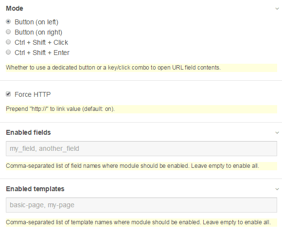

Test URL Field module for ProcessWire
================

Add button to URL fields to test link validity in [ProcessWire CMS](http://processwire.com/).

## Features

- add button to URL fields to test link validity (opens in a new window)
- linkify locked URL fields
- link visible only if field is not empty
- compatible with the Default & Reno admin themes
- button and key/click combo modes
- force "http://" prefix (optional)
- restrict module to selected templates or fields
- ajax-loaded tabs & fields ready

## Usage

1. Install the module. All URL type fields will automatically have a test link button.

1. Go to module settings and tweak options.

## Screens

**In action:**

**Options:**

**Linkify locked field:**

## Options

### Mode

You can choose whether to use a dedicated button or a key/click combo to open URL field contents.

The module currently supports three modes:

- Button (on left): adds a test link button to the left of the URL field (default)
- Button (on right): adds a test link button to the right of the URL field
- Ctrl + Shift + Click: link can be tested by holding down ctrl+shift and clicking on the field
- Ctrl + Shift + Enter: link can be tested by holding down ctrl+shift+enter while caret is in the field

### Force http

If checked, links will always have "http://" prefix, even if the field itself doesn't have it.

This option ensures opening external links instead of relative ones.

### Restrict module

Here you can set templates and/or fields where the module will be enabled. If none selected, module will be active on all templates and all URL fields.

Note: if used, module will be disabled on all non-listed fields/templates.

## Troubleshooting and feedback

Forum: [https://processwire.com/talk/topic/11209-modulette-test-url-field/](https://processwire.com/talk/topic/11209-modulette-test-url-field/)

## License

Licensed under the MIT license.

"Test URL Field" is provided "as-is" without warranty of any kind, express, implied or otherwise, including without limitation, any warranty of merchantability or fitness for a particular purpose. In no event shall the author of this software be held liable for data loss, damages, loss of profits or any other kind of loss while using or misusing this software.
